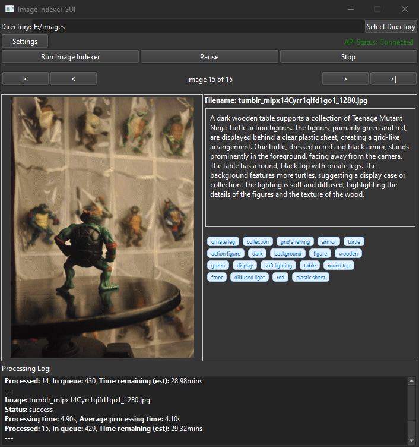

# LLMII: Locally Label Metadata and Index Images

LLMII uses a local AI to label metadata and index images. It does not rely on a cloud service or database.

A visual language model runs on your computer and is used to create captions and keywords for images in a directory tree. The generated information is then added to each image file's metadata. The images can then be indexed, searched, and organized by by their descriptions using any tool you like that can access the common metadata fields. The files themselves can be moved, renamed, copied, and edited without affecting the metadata.

On your first run you will need to choose a model to run. Your system specs will be shown next to state of the art models. When you launch the indexer the model will be downloaded to the LLMII 'resources' directory. From that point the entire toolset is running completely locally.



## Features
 
- **Image Analysis**: Utilizes a local AI model to generate a list of keywords and a caption for each image
- **Metadata Enhancement**: Can automatically edit image metadata with generated tags
- **Local Processing**: All processing is done locally on your machine
- **Multi-Format Support**: Handles a wide range of image formats, including all major raw camera files
- **User-Friendly GUI**: Includes a GUI and installer. Relies on Koboldcpp, a single executable, for all AI functionality
- **Simple Model Selection**: Choose a the state of the art model and it will be automatically downloaded and configured
- **Completely Automatic Backend Configuration**: The AI backend (KoboldCpp) will be downloaded and configured with optimal settings  
- **GPU Acceleration**: Will use Apple Metal, Nvidia CUDA, or AMD (Vulkan) hardware if available to greatly speed inference
- **Cross-Platform**: Supports Windows, macOS ARM, and Linux
- **Stop and Start Capability**: Can stop and start without having to reprocess all the files again
- **One or Two Step Processing**: Can do keywords and a simple caption in one step, or keywords and a detailed caption in two steps
- **Highly Configurable**: You are in control of everything

## Important Information

It is recommended to have a discrete graphics processor in your machine.

This tool verifies keywords and de-pluralizes them using rules that apply to English. Using it to generate keywords in other languages may have strange results.

This tool operates directly on image file metadata. It will write to one or more of the following fields:

  1. MWG:Keyword
  2. MWG:Description
  3. XMP:Identifier
  4. XMP:Status
  
The "Status" and "Identifier" fields are used to track the processing state of images. The "Description" field is used for the image caption, and "Subject" or "Keyword" fields are used to hold keywords.

**The use of the Identifier tag means you can manage your files and add new files, and run the tool as many times as you like without worrying about reprocessing the files that were previously keyworded by the tool.**
     
## Installation

### Prerequisites

- Python 3.8 or higher
- KoboldCPP
  
### Windows Installation

1. Clone the repository or download the [ZIP file](https://github.com/jabberjabberjabber/ImageIndexer/archive/refs/heads/main.zip) and extract it

2. Install [Python for Windows](https://www.python.org/downloads/windows/)

3. Run `llmii-windows.bat`

### macOS Installation (including ARM)

1. Clone the repository or download the [ZIP file](https://github.com/jabberjabberjabber/ImageIndexer/archive/refs/heads/main.zip) and extract it

2. Install Python 3.7 or higher if not already installed. You can use Homebrew:
   ```
   brew install python
   ```

3. Install ExifTool:
   ```
   brew install exiftool
   ```

4. Run the script:
   ```
   ./llmii.sh
   ```
   
5. If KoboldCpp fails to run, open a terminal in the 'resources' folder:
   ```
   xattr -cr ./resources/koboldcpp-mac-arm64
   chmod +x ./resources/koboldcpp-mac-arm64
   ```

### Linux Installation

1. Clone the repository or download and extract the ZIP file

2. Install Python 3.8 or higher if not already installed. Use your distribution's package manager, for example on Ubuntu:
   ```
   sudo apt-get update
   sudo apt-get install python3 python3-pip
   ```

3. Install ExifTool. On Ubuntu:
   ```
   sudo apt-get install libimage-exiftool-perl
   ```

4. Run the script:
   ```
   ./llmii.sh
   ```

5. If KoboldCpp fails to run, open a terminal in the 'resources' folder:
   ```
   chmod +x ./resources/koboldcpp-linux-x64
   ```

## Usage

1. Launch the LLMII GUI:
   - On Windows: Run `llmii-windows.bat`
   - On macOS/Linux: Run `./llmii.sh`

2. Ensure KoboldCPP is running. Wait until you see the following message in the KoboldCPP window:
   ```
   Please connect to custom endpoint at http://localhost:5001
   ```

3. Configure the indexing settings in the GUI

4. Click "Run Image Indexer" to start the process

5. Monitor the progress in the output area of the GUI.

## Languages

It is sometimes possible to get keywords or captions in a language besides English. You will need to modify the instruction and uncheck some keyword options. To do this:

1. In the GUI, click on "Settings" and then "Edit Instructions":
   - Replace ENGLISH in the instructions with the name of a different language

2. In Keyword Corrections:
   - Uncheck "Depluralize keywords"
   - Uncheck "Only Latin characters"

## Settings

   **Press the HELP button in the settings dialog.**
   
## More Information and Troubleshooting

Consult [the wiki](https://github.com/jabberjabberjabber/ImageIndexer/wiki) for detailed information.

## Contributing

Contributions are welcome! Please feel free to submit a Pull Request.

## License

This project is licensed under the GPLv3 License - see the LICENSE file for details.

## Acknowledgements

- [ExifTool](https://exiftool.org/) for metadata manipulation
- [KoboldCPP](https://github.com/LostRuins/koboldcpp) for local AI processing and for the GPU information logic
- [PyQt6](https://www.riverbankcomputing.com/software/pyqt/) for the GUI framework
- [Fix Busted JSON](https://github.com/Qarj/fix-busted-json) and [Json Repair](https://github.com/josdejong/jsonrepair) for help with mangled JSON parsing
