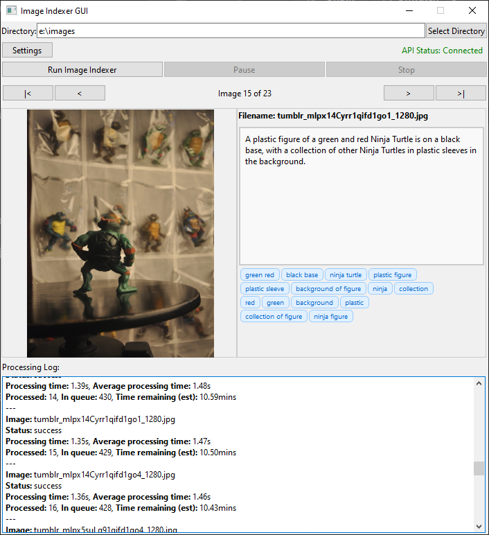

# LLMII 

LLMII uses a local AI to label metadata and index images. It does not rely on cloud services, remote APIs, or a database.

A visual language model runs on your computer and is used to create captions and keywords for all images in a directory tree. The generated information is then added to each image file's metadata so that the images can be indexed, searched, and organized using any tool you like that can access the common metadata fields. The files themselves can be moved, renamed, copied, and edited without affecting the metadata.

The indexer can be run on the same image files multiple times without reliance on a database. This enables you to:

- Add new generated data using the same or different AI models for comprehensive, rich and varied metadata
- Generate data for new files added into the image store directory without modifying images that were already processed by the tool
- Regenerate data for data for a new purpose, using a new instruction for the AI
- Discover files with invalid or corrupted parts so that they can be repaired or removed

Please remember to configure the settings before indexing. They are saved between runs.

<div align="center">
  
</div>

## Features
 
- **Image Analysis**: Utilizes a local AI model to generate a list of keywords and a caption for each image
- **Metadata Enhancement**: Can automatically add generated data to image metadata
- **Local Processing**: All processing is done locally on your machine
- **Multi-Format Support**: Handles a wide range of image formats, including all major raw camera files
- **User-Friendly GUI**: Includes a GUI and installer. Relies on Koboldcpp, a single executable, for all AI functionality
- **GPU Acceleration**: Will use Apple Metal, Nvidia CUDA, or AMD (Vulkan) hardware if available to greatly speed inference
- **Cross-Platform**: Supports Windows, macOS ARM, and Linux
- **Stop and Start Capability**: Can stop and start without having to reprocess all the files again
- **One or Two Step Processing**: Can do keywords and a simple caption in one step, or keywords and a detailed caption in two steps
- **Navigation**: Step backwards and forwards through the images and view the generated data as they are processed
 
## Important Information

It is highly recommended to have a discrete graphics processor with at least 4GB of VRAM and at least 8GB of system RAM.

This tool operates directly on image file metadata. It will write to one or more of the following fields:

  1. MWG:Keyword
  2. MWG:Description
  3. XMP:Identifier
  4. XMP:Status

Note that MWG is not an actual field but a direction for which actual field is to be used. This is handled by exiftool. Consult the [exiftool documentation](https://exiftool.org/TagNames/MWG.html) for information about the MWG field. 

## Installation

### Prerequisites

- Python 3.8 or higher

The batch file or shell scripts will setup a Python environment, install the prequisites, download the model weights, and start the inference engine and the indexer. 

[KoboldCpp](https://github.com/LostRuins/koboldcpp) is used as the inference engine because it is a single binary, it is multiplatform and extremely fast, and it allows automatic downloading of model weights from HuggingFace. The model used is [Qwen2-VL 2B Instruct](https://huggingface.co/Qwen/Qwen2-VL-2B-Instruct). However, it is not necessary to use these specifically; **you can use any OpenAI compatible inference engine with any vision capable model.**
 
  
### Windows Quick Installation

1. Clone the repository or download the [ZIP file](https://github.com/jabberjabberjabber/llmii/archive/refs/heads/main.zip) and extract it

2. Install [Python for Windows](https://www.python.org/downloads/windows/)

3. Run `llmii.bat` and follow prompts

### macOS Quick Installation (including ARM)

1. Clone the repository or download the [ZIP file](https://github.com/jabberjabberjabber/llmii/archive/refs/heads/main.zip) and extract it

2. Install Python 3.8 or higher if not already installed. You can use Homebrew:
   ```
   brew install python
   ```

3. Run the script:
   ```
   ./llmii.sh
   ```
   
4. If KoboldCpp fails to run, open a terminal in the LLMII folder:
   ```
   xattr -cr koboldcpp-mac-arm64
   chmod +x koboldcpp-mac-arm64
   ```

### Linux Quick Installation

1. Clone the repository or download and extract the ZIP file

2. Install Python 3.8 or higher if not already installed. Use your distribution's package manager, for example on Ubuntu:
   ```
   sudo apt-get update
   sudo apt-get install python3 python3-pip
   ```

4. Run the script:
   ```
   ./llmii.sh
   ```

5. If KoboldCpp fails to run, open a terminal in the LLMII folder:
   ```
   chmod +x koboldcpp-linux-x64
   ```

For all platforms, the script will set up the Python environment, install dependencies, and download necessary model weights. This initial setup is performed only once and will take a few minutes depending on your download speed.

### Installation Without Scripts

1. Clone the repo

2. Create a Python environment and install packages from requirements.txt

3. Install ExifTool

4. Start an inference engine and load a vision capable model

5. Run llmii_gui.py using python

## Usage

1. Configure the settings in the GUI

2. Wait until you see API Connected 

3. Click "Run Image Indexer" to start the process

4. Monitor the progress in the output area of the GUI.

5. You can navigate through the images with the back and forward buttons

## Contributing

Contributions are welcome! Please feel free to submit a Pull Request.

## License

This project is licensed under the GPLv3 License - see the LICENSE file for details.

## Acknowledgements

- [ExifTool](https://exiftool.org/) for metadata manipulation
- [KoboldCPP](https://github.com/LostRuins/koboldcpp) for local AI processing
- [PyQt6](https://www.riverbankcomputing.com/software/pyqt/) for the GUI framework
- [Fix Busted JSON](https://github.com/Qarj/fix-busted-json) and [Json Repair](https://github.com/josdejong/jsonrepair) for help with mangled JSON parsing
